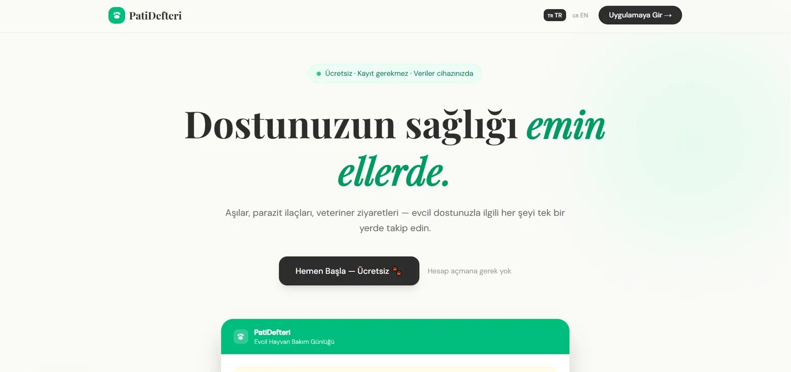
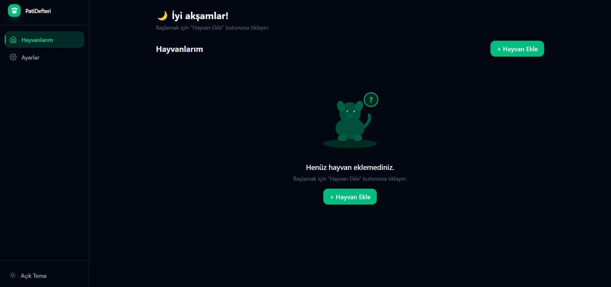
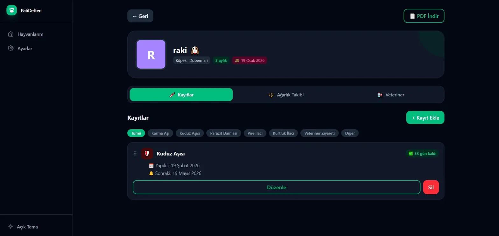
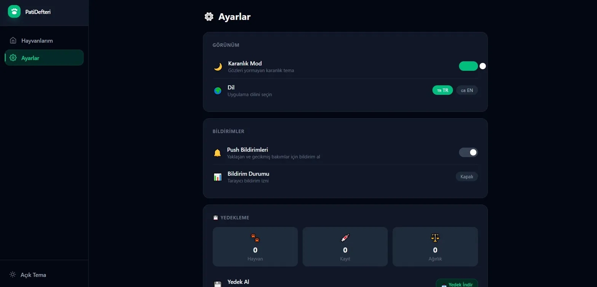

# 🐾 PatiDefteri

> Evcil hayvanlarınızın aşı, bakım ve sağlık geçmişini takip etmek için geliştirilmiş modern web uygulaması.

**🌐 Canlı Demo:** [pati-defteri.vercel.app](https://pati-defteri.vercel.app)

---

## 📸 Ekran Görüntüleri

### 🏠 Landing Page

### 🐾 Anasayfa — Hayvanlarım

### 🐶 Hayvan Detay — Kayıtlar

### ⚙️ Ayarlar

---

## ✨ Özellikler

### 🐶 Hayvan Yönetimi
- Kedi, köpek ve diğer evcil hayvanlar için profil oluşturma
- Fotoğraf, cins, doğum tarihi ve notlar
- Otomatik yaş hesaplama
- Renkli harf avatarı (fotoğraf yoksa)
- İsme göre arama

### 💉 Aşı & Bakım Takibi
- Karma aşı, kuduz, parazit damlası, pire ilacı ve daha fazlası
- Sonraki tarih hatırlatıcıları
- Gecikmiş ve yaklaşan bakımlar için uyarı sistemi
- Drag & drop ile kayıt sıralama
- Kayıt türüne göre filtreleme

### ⚖️ Ağırlık Takibi
- Zaman içindeki kilo değişimini grafik ile görselleştirme
- Recharts ile interaktif ağırlık grafiği

### 🏥 Veteriner Bilgisi
- Klinik adı, doktor, telefon ve adres
- Tek tıkla arama ve Google Maps yönlendirme

### 📄 PDF Rapor
- Tüm sağlık geçmişini tek tıkla PDF olarak indirme
- Veterinere götürmek için hazır format

### 💾 Yedekleme
- JSON olarak veri export/import
- Drag & drop ile yedek yükleme

### 🔔 Bildirimler
- Tarayıcı push bildirimleri
- Yaklaşan ve gecikmiş bakımlar için otomatik hatırlatıcı

### 🎨 Kullanıcı Deneyimi
- Karanlık / Açık tema
- Türkçe / İngilizce dil desteği
- Framer Motion animasyonları
- Skeleton loading ekranları
- Responsive tasarım (mobil uyumlu)
- PWA desteği (telefona uygulama olarak kurulabilir)
- Onboarding akışı
- Konfeti animasyonu

---

## 🛠️ Kullanılan Teknolojiler

| Teknoloji | Açıklama |
|-----------|----------|
| React 19 | UI framework |
| Vite 8 | Build tool |
| Tailwind CSS 4 | Styling |
| Framer Motion | Animasyonlar |
| React Router v7 | Sayfa yönetimi |
| Recharts | Grafikler |
| i18next | Çoklu dil desteği |
| jsPDF | PDF oluşturma |
| @dnd-kit | Drag & drop |
| canvas-confetti | Konfeti efekti |
| react-hot-toast | Bildirimler |

## 👨‍💻 Geliştirici

**Yusuf Koşar**