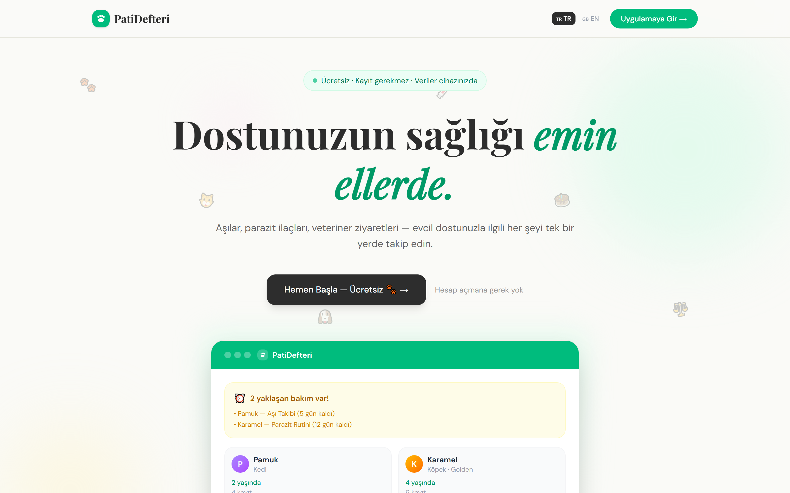
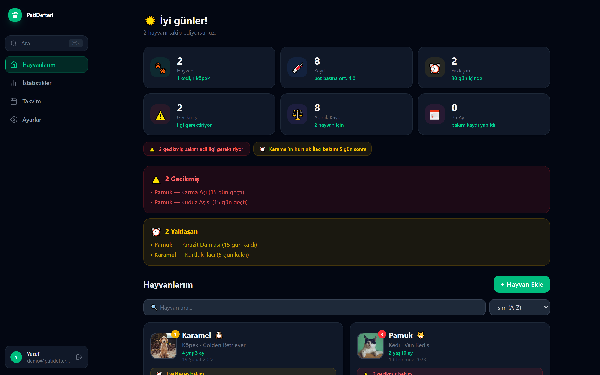
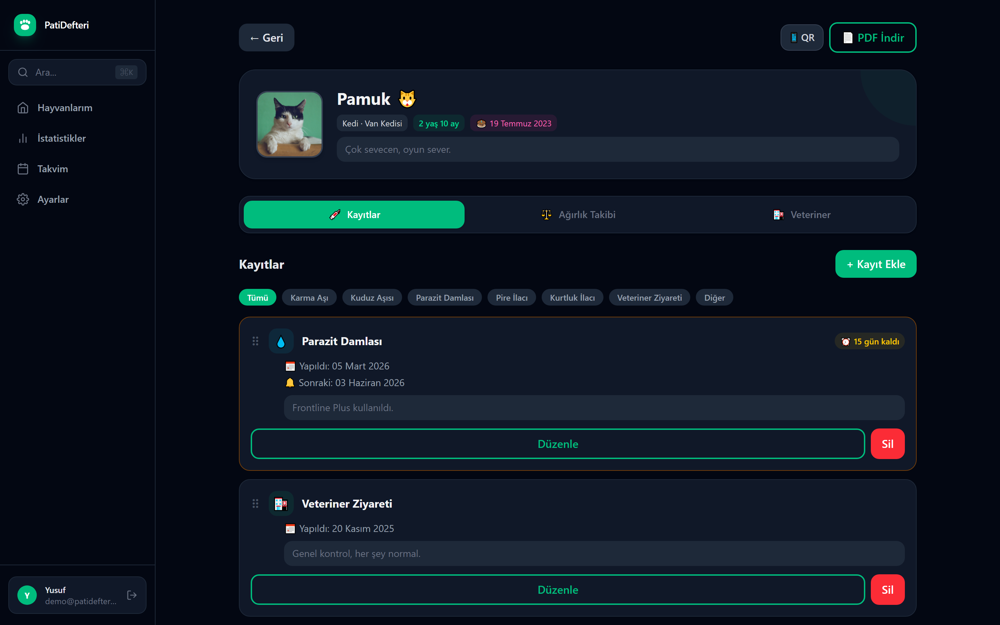
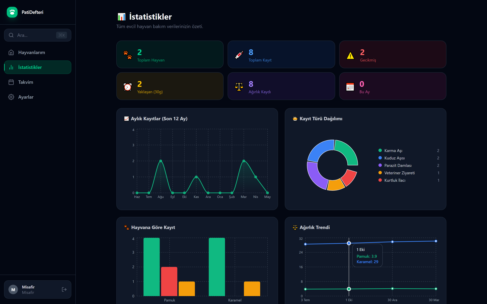
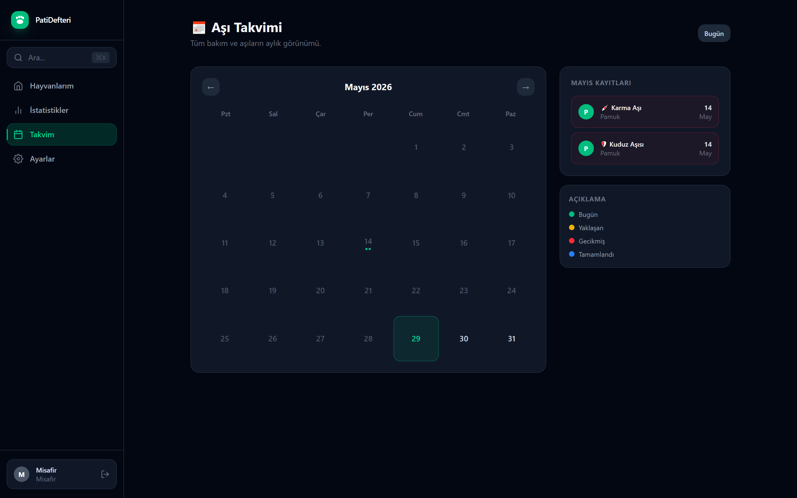
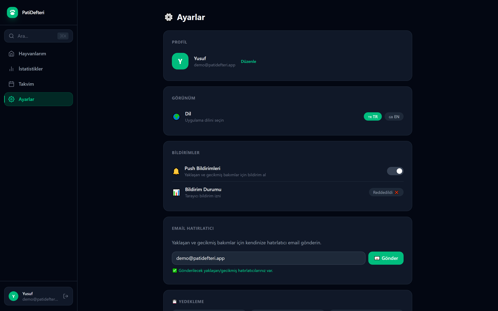

# 🐾 PatiDefteri

> Evcil hayvanlarınızın aşı, bakım ve sağlık geçmişini tek bir yerden takip etmenizi sağlayan tam-yığın (fullstack) web uygulaması.

[](https://github.com/YusufKosarDev/pati-defteri/actions/workflows/ci.yml)
[](LICENSE)


**🌐 Canlı Demo:** [pati-defteri.vercel.app](https://pati-defteri.vercel.app)

> 💡 **"Misafir olarak devam et"** ile demoyu hemen dene — örnek hayvanlar ve kayıtlar otomatik yüklenir.

---

## 📸 Ekran Görüntüleri

### 🏠 Landing Page


### 🐾 Anasayfa — Hayvanlarım


### 🐶 Hayvan Detay — Kayıtlar


### 📊 İstatistikler


### 📅 Aşı Takvimi


### ⚙️ Ayarlar


---

## ✨ Özellikler

### 🔐 Hesap & Senkronizasyon
- Email / şifre ile kayıt ve giriş
- Misafir modu (hızlı deneme için tek tıkla giriş)
- Çok cihazlı gerçek-zamanlı senkronizasyon — bir tarayıcıda eklediğin kayıt, diğerinde anında görünür

### 🐶 Hayvan Yönetimi
- Kedi, köpek ve diğer evcil hayvanlar için profil
- Fotoğraf, cins, doğum tarihi ve notlar
- Otomatik yaş hesaplama
- Renkli harf avatarı (fotoğraf yoksa)
- İsme göre arama, çoklu sıralama seçenekleri
- Birden fazla veteriner bilgisi

### 💉 Aşı & Bakım Takibi
- Karma aşı, kuduz, parazit damlası, pire ilacı ve diğerleri
- Sonraki tarih hatırlatıcıları
- Gecikmiş ve yaklaşan bakımlar için uyarı sistemi
- Drag & drop ile kayıt sıralama (sunucuda kalıcı)
- Kayıt türüne göre filtreleme

### ⚖️ Ağırlık Takibi
- Zaman içindeki kilo değişimi için interaktif grafik

### 📊 İstatistikler & Takvim
- Aylık kayıt grafiği, tür dağılımı, hayvan başı kayıt karşılaştırması
- Tüm bakımların aylık takvim görünümü

### 🔔 Sunucu-tetikli Push Bildirimleri
- VAPID tabanlı Web Push aboneliği
- Uygulama kapalıyken bile gelen bildirimler
- Her gün otomatik tarama (Convex cron) — yaklaşan ve gecikmiş bakımlar için bildirim

### 📄 PDF Rapor & 📱 QR Paylaşımı
- Hayvanın tüm sağlık geçmişini tek tıkla PDF olarak indir
- Hayvanın sağlık kartını QR kod ile veterinerinle paylaş

### 💾 Yedekleme
- Tüm verini JSON olarak indir / yükle
- Eski formatları geriye dönük uyumlu içe aktarır (tek mutation'da)

### 🎨 Kullanıcı Deneyimi
- Modern karanlık tema
- Türkçe / İngilizce dil desteği
- Framer Motion animasyonları, skeleton loading
- Responsive tasarım (mobil uyumlu)
- PWA — telefona uygulama olarak kurulabilir
- Onboarding ve konfeti animasyonu
- **Erişilebilirlik:** dialog `role`/`aria` + focus-trap, klavye desteği (Esc/Tab/Enter), `prefers-reduced-motion` ile hareket kısma

---

## 🏗️ Mimari

```
┌──────────────────────┐         ┌──────────────────────┐
│  React 19 + Vite     │ ◀────▶  │  Convex (Backend)    │
│  Tailwind, Recharts  │         │  • Postgres tables   │
│  Framer Motion       │         │  • Auth (Anonymous + │
│  PWA + Service Worker│         │    Password)         │
└──────────┬───────────┘         │  • Storage (foto CDN)│
           │                     │  • Actions (Node JS) │
           │                     │  • Cron (günlük push)│
   Web Push (VAPID)              └──────────┬───────────┘
           │                                │
           ▼                                ▼
   Tarayıcı / Telefon             web-push + Resend
```

- **Frontend:** Vite + React, tüm UI client-side, uçtan uca TypeScript
- **Backend:** Convex — gerçek-zamanlı Postgres + sunucu fonksiyonları + dosya depolama
- **Auth:** `@convex-dev/auth` — Anonymous (misafir) + Password (kayıt) provider'ları, her mutation server-side ownership guard'ı ile korunur
- **Storage:** Hayvan fotoğrafları Convex Storage (CDN), DB satırlarına gömülmez; foto değişimi/silinmesinde eski objeyi otomatik temizler (yetim dosya bırakmaz)
- **Sunucu tarafı güvenlik:** Kullanıcı başına rate-limit (`pets/records/weights` create + update + remove), alan başına length validation (`name ≤ 100`, `notes ≤ 2000`, vb.), `reorder` array uzunluk tavanı, tipli `ownership` guard'ları paylaşılan modülde
- **Veri modeli:** Pet/Record türleri **stabil anahtar** olarak saklanır (`cat`/`mixed_vaccine` …); legacy lokalize değerler okuma sırasında normalize edilir (geriye dönük yedek uyumluluğu)
- **Bildirim:** Convex action içinde `web-push` ile VAPID push; günlük cron tarama
- **Observability:** Sentry (opsiyonel) — error + replay-on-error
- **Hosting:** Vercel (frontend) + Convex deployment (backend)

---

## 🛠️ Teknoloji Yığını

### Frontend
| Paket | Kullanım |
|-------|----------|
| React 19 | UI framework |
| Vite 8 | Build tool |
| Tailwind CSS 4 | Styling |
| Framer Motion | Animasyonlar |
| React Router v7 | Sayfa yönetimi |
| Recharts | Grafikler |
| i18next | Çoklu dil |
| jsPDF | PDF üretimi |
| @dnd-kit | Drag & drop |
| qrcode.react | QR kod üretimi |
| canvas-confetti | Konfeti |
| react-hot-toast | Bildirim toast'ları |

### Backend & Altyapı
| Paket | Kullanım |
|-------|----------|
| Convex | Postgres + queries + actions + cron + storage |
| @convex-dev/auth | Email/şifre + anonim oturum |
| web-push | VAPID tabanlı Web Push |
| Resend | E-posta hatırlatıcıları |

### Test & Kalite
| Paket | Kullanım |
|-------|----------|
| TypeScript | Tip güvenliği (strict mode, frontend uçtan uca TS) |
| Vitest + jsdom | Client unit testler |
| React Testing Library | Komponent testleri (render + etkileşim + a11y) |
| convex-test + edge-runtime | Convex backend entegrasyon testleri (auth + ownership + veri silme/taşıma) |
| Playwright | E2E smoke testleri + otomatik ekran görüntüsü |
| GitHub Actions | CI (lint · typecheck · test · build) |
| ESLint + react/react-hooks | Statik analiz, anti-pattern yakalama |
| husky + lint-staged | Pre-commit hook (lint + typecheck + test) |
| Sentry | Production hata izleme + session replay (error-only) |

---

## 🧑‍💻 Lokal Geliştirme

```bash
# 1) Bağımlılıkları kur
npm install

# 2) Convex backend'i başlat (ilk çalıştırmada login + proje yaratır)
npx convex dev

# 3) Ayrı bir terminalde Vite dev server
npm run dev
```

`.env.example`'a göre `.env.local` dosyanı doldur:

```ini
VITE_CONVEX_URL=          # npx convex dev otomatik doldurur
VITE_VAPID_PUBLIC_KEY=    # Web Push için VAPID public key (opsiyonel)
VITE_SENTRY_DSN=          # Production hata izleme (opsiyonel)
```

Web Push anahtarları üretmek için:

```bash
node -e "import('web-push').then(({default:wp}) => console.log(wp.generateVAPIDKeys()))"
```

Üretilen değerleri Convex deployment ortamına yaz:

```bash
npx convex env set VAPID_PUBLIC_KEY  <publicKey>
npx convex env set VAPID_PRIVATE_KEY <privateKey>
npx convex env set VAPID_SUBJECT     "mailto:senin@email.com"
```

---

## 🧪 Test & Kalite Kontrol

```bash
npm run lint         # ESLint (0 hata politikası)
npm run typecheck    # tsc --noEmit (strict mode)
npm run test         # Vitest — client (jsdom) + convex (edge-runtime) projeleri
npm run test:watch   # İzleme modu
npm run e2e          # Playwright E2E smoke testleri (Vite'ı otomatik başlatır)
npm run build        # Üretim derlemesi
npm run screenshots  # README ekran görüntülerini yeniden üret (Playwright)
```

### Üç katmanlı kalite koruması

1. **Pre-commit hook** (`.husky/pre-commit`) — `lint-staged` (max-warnings=0) + `typecheck` + tüm testler. Kırık kod commit edilemez.
2. **PR template** (`.github/PULL_REQUEST_TEMPLATE.md`) — kod, güvenlik, test, UI ve performans kategorilerinde self-review checklist.
3. **GitHub Actions** (`.github/workflows/ci.yml`) — her push/PR'de `lint · typecheck (src + convex) · test · build` dördü de zorunlu (Ubuntu / Node 24).

### Test mimarisi

Vitest iki proje config'i kullanır:
- **`client`** projesi (`jsdom` env) — util testleri (tarih hesaplamaları, tür normalize/etiket sistemi) + React Testing Library ile komponent testleri (Modal/ConfirmModal a11y davranışı, AuthPage form doğrulaması).
- **`convex`** projesi (`edge-runtime` env) — `convex-test` ile gerçek mutation/query'ler; auth, ownership, hesap silme/veri taşıma, fotoğraf orphan koruması, reorder abuse limiti, length validation ve hatırlatıcı bucket mantığı sabit testlerle korunur.

Ayrıca **Playwright E2E** (`e2e/`) — routing, lazy-load ve temel akışları gerçek tarayıcıda (chromium) doğrular; `npm run e2e` ile çalışır.

---

## 📁 Proje Yapısı

```
.
├─ convex/                  # Backend (Convex)
│  ├─ schema.ts             # DB şeması (pets, records, weights, ...)
│  ├─ pets.ts               # Pet CRUD (auth'lu + foto storage temizliği)
│  ├─ records.ts            # Bakım kaydı CRUD + reorder
│  ├─ weights.ts            # Ağırlık CRUD
│  ├─ files.ts              # Storage upload URL
│  ├─ backup.ts             # Toplu içe aktarma (yedek + demo)
│  ├─ auth.ts               # Convex Auth (Password + Anonymous)
│  ├─ users.ts              # viewer query, updateName
│  ├─ account.ts            # Şifre değiştirme, hesap silme, misafir → kayıtlı yükseltme
│  ├─ email.ts              # Resend ile e-posta hatırlatıcı action
│  ├─ push.ts               # Web Push abonelik + manuel test
│  ├─ reminders.ts          # Günlük tarama action (Node runtime)
│  ├─ remindersInternal.ts  # Bucket'lama mantığı (internal query)
│  ├─ emailInternal.ts      # E-posta içeriğini sunucuda hazırla
│  ├─ crons.ts              # Scheduled jobs
│  ├─ validators.ts         # Sunucu tarafı length validation helper'ı
│  ├─ rateLimit.ts          # Fixed-window rate limiter
│  ├─ recordTypeLabel.ts    # Kayıt türü anahtar → TR etiket (bildirimler için)
│  └─ lib/                  # Paylaşılan helper'lar (auth guard, dates, vetArg)
├─ src/
│  ├─ pages/                # LandingPage, HomePage, PetDetailPage, ...
│  ├─ components/           # Pet, Record, Weight, Vet, Layout, UI
│  ├─ context/              # AuthProvider, PetProvider (tipli context value'lar)
│  ├─ hooks/                # useAuth, usePet, useNotifications, useConfetti, ...
│  ├─ lib/                  # convex client, sentry init, pdfExport, friendlyError
│  ├─ utils/                # dateHelpers, petType, recordTypes, sortRecords + testleri
│  ├─ types.ts              # Paylaşılan domain tipleri (Pet, PetRecord, Vet, ...)
│  ├─ i18n/                 # tr + en (250+ anahtar, interpolation desteği)
│  └─ vite-env.d.ts         # Vite env var tipleri
├─ public/                  # PWA manifest, sw.js, ikonlar
├─ scripts/                 # screenshots.mjs
└─ .github/
   ├─ workflows/ci.yml             # lint · typecheck · test · build
   └─ PULL_REQUEST_TEMPLATE.md     # Self-review checklist
```

---

## 📄 Lisans

MIT — bkz. [LICENSE](LICENSE).

---

## 👨‍💻 Geliştirici

**Yusuf Koşar**
